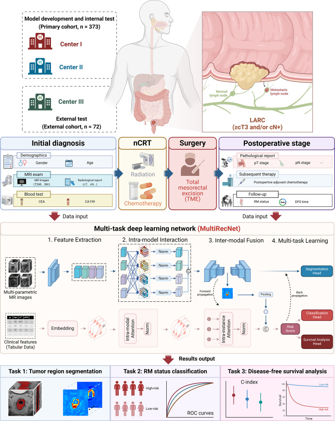
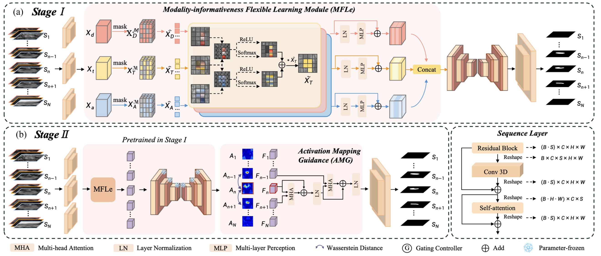
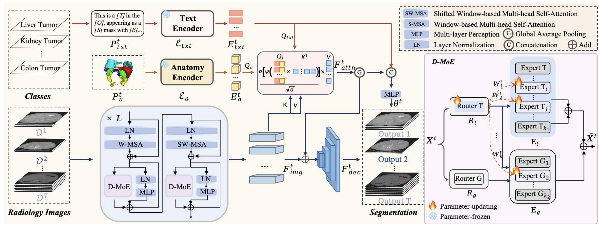
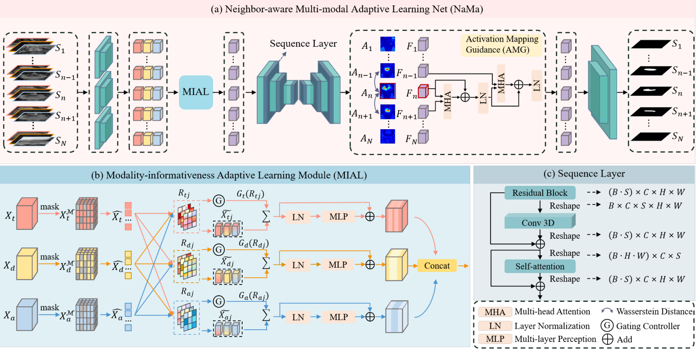
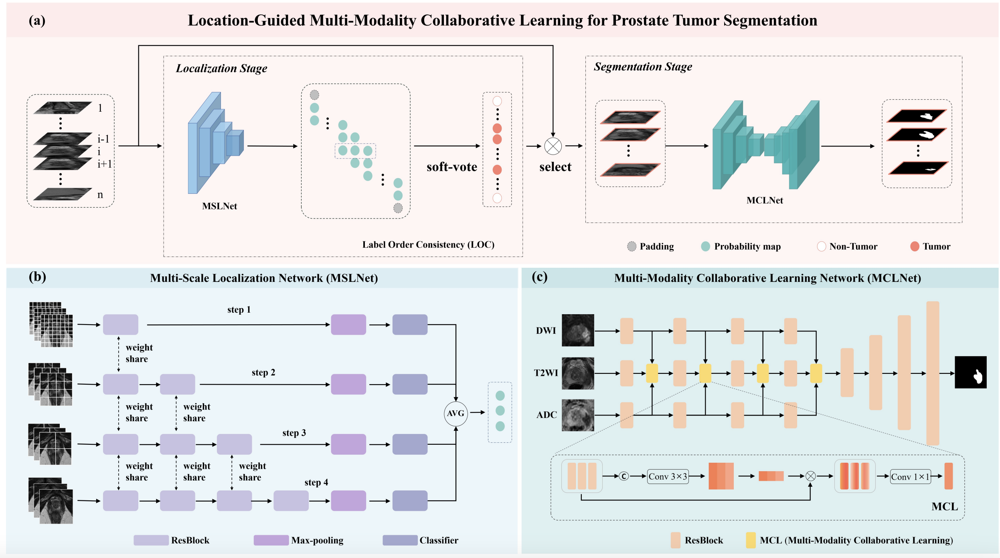








# Runqi Meng's Homepage

I am currently a PhD student in **Computer Science** at the Department of Biomedical Engineering, **ShanghaiTech University**, advised by **Prof. Dinggang Shen**. I received my B.Eng. degree in Electronic Information Science and Technology from the College of Physics and Electronics, **Central South University**, China, in 2021. From September 2024 to August 2025, I was a visiting researcher at **Massachusetts General Hospital** and **Harvard Medical School**, supervised by **Prof. Quanzheng Li**. Prior to that, from June 2024 to August 2024, I worked as a research intern at **United Imaging Intelligence Co., Ltd. (UII)**.

My research focuses on medical artificial intelligence, particularly **vision-language models**, **multi-modal learning**, and **foundation models** for medical image analysis. My current work focuses on **tumor segmentation**, **pan-cancer modeling**, and building **generalizable AI systems** that integrate imaging and clinical data for diagnosis and prognosis.

# 🔥 News
- *[09/2025]*: One paper accepted by Radiology: Imaging Cancer.
- *[06/2025]*: One paper accepted by BMC Medical Informatics and Decision Making.
- *[06/2025]*: One paper accepted by MICCAI.
- *[06/2025]*: Three papers accepted by SNMMI.
- *[04/2025]*: One paper accepted by IEEE Transactions on Biomedical Engineering (IEEE TBME).
- *[09/2024]*: Visited Massachusetts General Hospital and Harvard Medical School.
- *[06/2024]*: Two papers accepted by MICCAI.
- *[05/2024]*: One paper accepted by ISMRM.
- *[03/2024]*: One paper accepted by AAAI.
- *[01/2024]*: One paper accepted by IEEE Transactions on Medical Imaging (IEEE TMI).
- *[04/2023]*: One paper accepted by IEEE ISBI.
- *[11/2021]*: One paper accepted by Nature Communications.
- *[09/2021]*: Joined IDEA Lab, ShanghaiTech University under the supervision of Prof. Dinggang Shen.
- *[06/2021]*: Obtained B.Eng. degree from Central South University.

# 📝 Selected Publications | ^ (co-first author)

Radiology: Imaging Cancer

[Predicting Recurrence in Locally Advanced Rectal Cancer using Multi-task Deep Learning and Multimodal MRI](https://pmc.ncbi.nlm.nih.gov/articles/PMC12130701/pdf/rycan.240359.pdf)
  
Zonglin Liu^, **Runqi Meng^**, Qiong Ma, Yiqun Sun, Yanfen Cui, Xiaoyan Zhang, Tong Tong, Dinggang Shen

**Radiology: Imaging Cancer, 2025**

[**[Paper]**](https://pmc.ncbi.nlm.nih.gov/articles/PMC12130701/pdf/rycan.240359.pdf)

TBME 2025

[A Neighbor-sensitive Multi-modal Flexible Learning Framework for Improved Prostate Tumor Segmentation in Anisotropic MR Images](https://ieeexplore.ieee.org/stamp/stamp.jsp?tp=&arnumber=10971210)
  
**Runqi Meng**, Jingli Chen, Kaicong Sun, Qianqian Chen, Xiao Zhang, Ling Dai, Yuning Gu, Guangyu Wu, Dinggang Shen
  
**TBME, 2025**

[**[Paper]**](https://ieeexplore.ieee.org/stamp/stamp.jsp?tp=&arnumber=10971210)

MICCAI 2025

[MAST-Pro: Dynamic Mixture-of-Experts for Adaptive Segmentation of Pan-Tumors with Knowledge-Driven Prompts](https://papers.miccai.org/miccai-2025/paper/0362_paper.pdf)
  
**Runqi Meng**, Sifan Song, Pengfei Jin, Lin Teng, Yujin Oh, Yulin Wang, Yiqun Sun, Ling Chen, Xiang Li, Quanzheng Li, Ning Guo, Dinggang Shen
  
**MICCAI, 2025**

[**[Paper]**](https://papers.miccai.org/miccai-2025/paper/0362_paper.pdf)

AAAI 2024

[NaMa: Neighbor-Aware Multi-Modal Adaptive Learning for Prostate Tumor Segmentation on Anisotropic MR Images](https://ojs.aaai.org/index.php/AAAI/article/view/28215)
  
**Runqi Meng**, Xiao Zhang, Shijie Huang, Yuning Gu, Nizhuan Wang, Kaicong Sun, Dinggang Shen
  
**AAAI, 2024**

[**[Paper]**](https://ojs.aaai.org/index.php/AAAI/article/view/28215)

BMC Medical Informatics and Decision Making, 2025

[Multitask Deep Learning Model based on Multimodal Data for Predicting Prognosis of Rectal Cancer: A Multicenter Retrospective Study](https://papers.miccai.org/miccai-2025/paper/0362_paper.pdf](https://pmc.ncbi.nlm.nih.gov/articles/PMC12143085/)
  
Qiong Ma^, **Runqi Meng^**, Ruiting Li, Ling Dai, Fu Shen, Jie Yuan, Danqi Sun, Manman Li, Caixia Fu, Rong Li, Feng Feng, Yonggang Li, Tong Tong, Yajia Gu, Yiqun Sun, Dinggang Shen
  
**BMC Medical Informatics and Decision Making, 2025**

[**[Paper]**](https://pmc.ncbi.nlm.nih.gov/articles/PMC12143085/)

ISBI 2023

[Location-Guided Multi-Modality Collaborative Learning for Prostate Tumor Segmentation](https://ieeexplore.ieee.org/abstract/document/10230556)
  
**Runqi Meng**, Xiao Zhang, Shijie Huang, Yuning Gu, Guangyu Wu, Guiqin Liu, Dinggang Shen
  
**ISBI, 2023**

[**[Paper]**](https://ieeexplore.ieee.org/abstract/document/10230556)

# 📖 Education

- *[09/2021] – Present*: Ph.D. in Computer Science and Biomedical Engineering, ShanghaiTech University, Shanghai, China.
- *[09/2017] – [06/2021]*: B.Eng. in Electronic Information Science and Technology, Central South University, Changsha, China.

# 💼 Experience

- *[09/2024] – [09/2025]*: Visiting Research Scholar, Massachusetts General Hospital and Harvard Medical School, Boston, MA, USA.
- *[06/2024] – [08/2024]*: Research Intern, United Imaging Intelligence (UII), Shanghai, China.

# 🎖 Selected Honors and Awards

- Outstanding Student Award, ShanghaiTech University, [2024], [2025].
- National Encouragement Scholarship, Ministry of Education of China, [2018], [2020].
- Academic Excellence Scholarship, Central South University and ShanghaiTech University, [2018], [2019], [2020], [2022], [2023], [2024], [2025].

